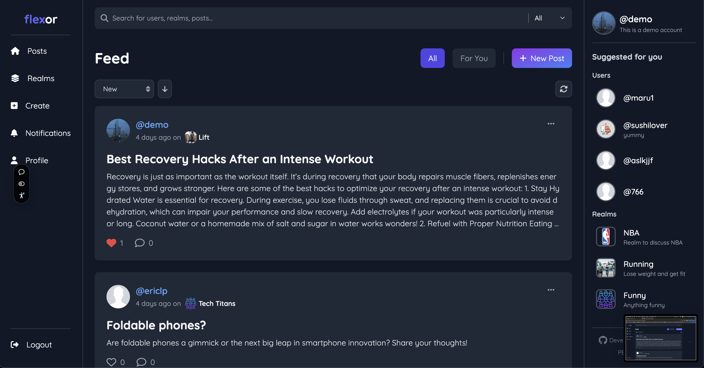
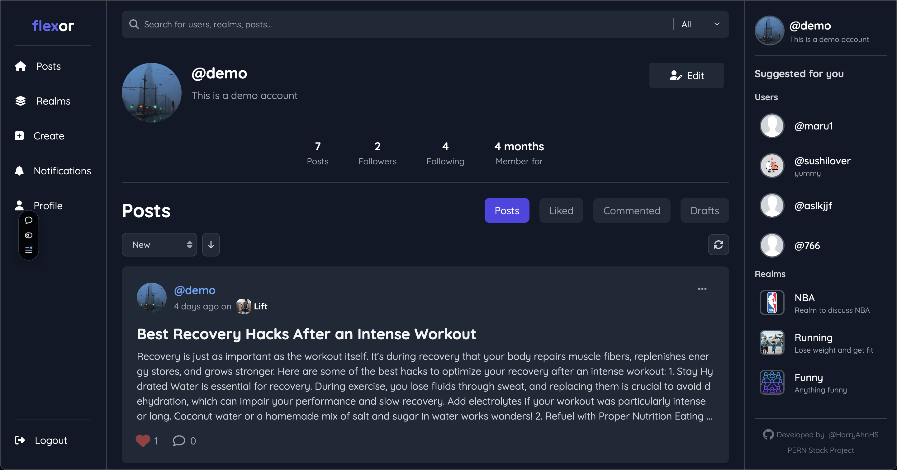
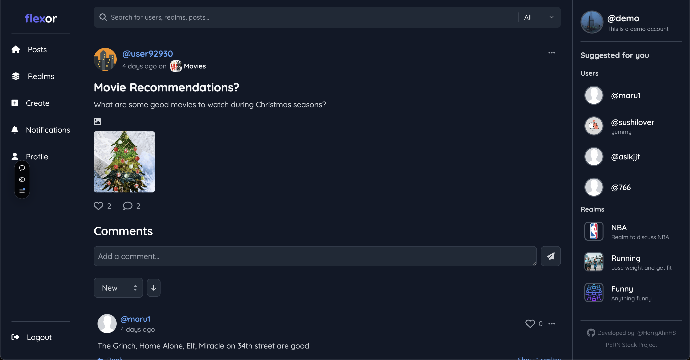
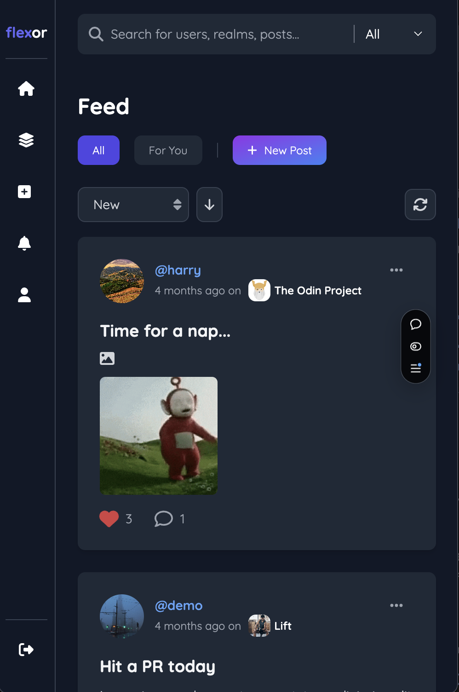

# Flexor-front-end
Frontend build of interactive social media platform using ReactJS.

## Link to Live
https://flexor-front-end-2c6r.vercel.app/feed

## Back End
Source code for the REST API Repo can be found here: https://github.com/HarryAhnHS/flexor-api
